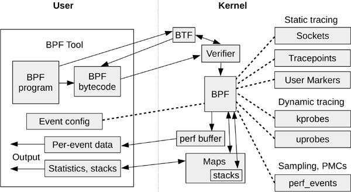
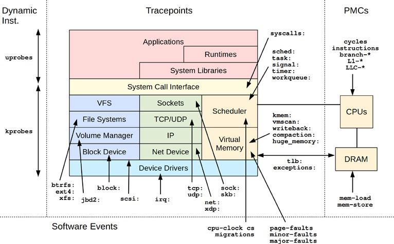

# BPF

> Extended BPF is often abbreviated as eBPF, but the official abbreviation is 
> still BPF, without the "e", so throughout this book I use BPF to refer to 
> extended BPF. The kernel contains only one execution engine BPF (extended BPF),
> which runs both extended BPF and "classic" BPF programs.

# Frontends

- `BCC` (`BPF Compiler Collection`) - tracing framework for BPF - [https://github.com/iovisor/bcc](https://github.com/iovisor/bcc)
- `bpftrace` - high-level language for developing BPF tools - [https://github.com/iovisor/bpftrace](https://github.com/iovisor/bpftrace)

# BPF ilustrated

# Instrumentation
- Dynamic instrumentation
    - kprobes
    - uprobes
- Static instrumentation
    - tracepoints
    - USDT (user-level statically defined tracing)

# BPF virtual file system
- `/sys/fs/bfp`
