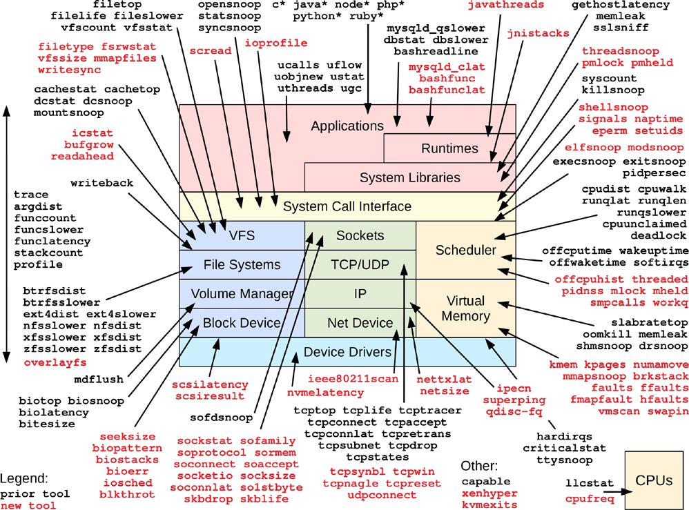
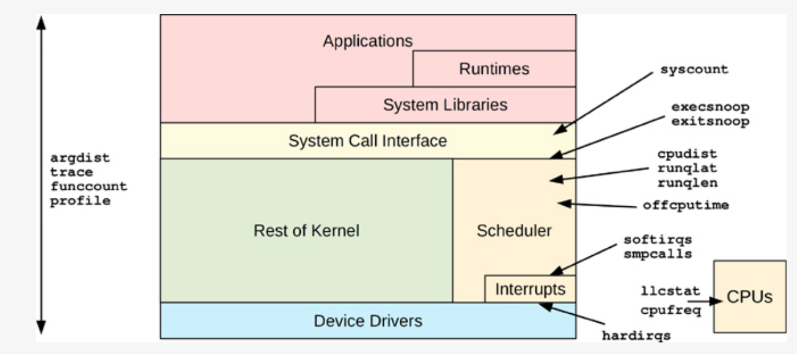

---

[github.com/iovisor/bcc](https://github.com/iovisor/bcc)

BCC repo structure:

IMAGE GOES HERE

BCC requires some kernel `CONFIG_` options to be set, see [INSTALL.md](https://github.com/iovisor/bcc/blob/master/INSTALL.md) for all the details.

As a rule of thumb
  - `bcc` tools are heavier, includes a lot of options, etc...
  - `bpftrace` tools are lighter, often oneliners, etc...

---

BCC performance tools:

IMAGE GOES HERE

### multi-purpose tools
- [funccount](../../../COMMANDS/FUNCCOUNT/index.md) - counts events, especially function calls, and can aswer questions such as:
    - is the kernel- or user-level function being called?
    - what is the rate of this function call, per second?

- [stackcount](../../../COMMANDS/STACKCOUNT/index.md) - counts the stack traces that led to en event, can answer the questions:
    - why is this event called? What is the code path?
    - what are all the different code paths taht call this event and what are their frequencies?

- [trace](../../../COMMANDS/TRACE/index.md) - tool for per-event tracing from many different sources: kprobes, uprobes, tracepoints and USDT probes, can answer questions:
    - what are the arguments when a kernel- or user-level function is called?
    - what is the return value of this function? is it failing?
    - how is this function called? what is the user- or kernel-level stack trace?

- [argdist](../../../COMMANDS/ARGDIST/index.md) - multi-tool that summarizes arguments
