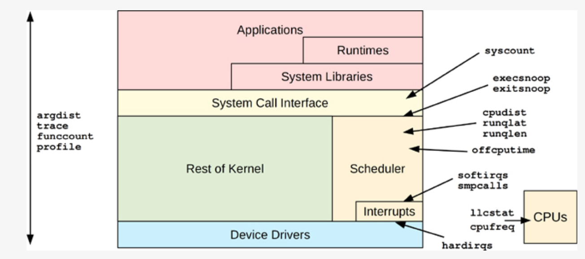

---

[github.com/iovisor/bpftrace](https://github.com/iovisor/bpftrace)

bpftrace repo structure:

IMAGE GOES HERE


`bpftrace` (similary to `BCC`) requires some kernel `CONFIG_` options to be set, see [INSTALL.md](https://github.com/iovisor/bpftrace/blob/master/INSTALL.md) for all the details.

As a rule of thumb
  - `bcc` tools are heavier, includes a lot of options, etc...
  - `bpftrace` tools are lighter, often oneliners, etc...

---

`bpftrace` performance tools:

IMAGE GOES HERE



### bpftrace on-liners
`bpftrace` tool in most cases is used as a one-liners, below some examples (also see official repo for more examples):
- `bpftrace -e 'tracepoint:syscalls:sys_enter_execve { printf("%s -> %s\n", comm, str(args->filename)); }'` - show who is executing what
- `bpftrace -e 'tracepoint:syscalls:sys_enter_execve { join(args->argv); }'` - show new processes with arguments
- `bpftrace -e 'tracepoint:syscalls:sys_enter_openat { printf("%s %s\n", comm, str(args->filename)); }'` - show files opened using openat() by process
- `bpftrace -e 'tracepoint:raw_syscalls:sys_enter { @[comm] = count(); }'` - count syscalls by program
- `bpftrace -e 'tracepoint:syscalls:sys_enter_* { @[probe] = count(); }'` - count syscalls by syscall probe name
- `bpftrace -e 'tracepoint:raw_syscalls:sys_enter { @[pid, comm] = count(); }'` - count syscalls by process
- `bpftrace -e 'tracepoint:syscalls:sys_exit_read /args->ret/ { @[comm] = sum(args->ret); }'` - show the total read bytes by process
- `bpftrace -e 'tracepoint:syscalls:sys_exit_read { @[comm] = hist(args->ret); }'` - show the read size distribution by process
- `bpftrace -e 'tracepoint:block:block_rq_issue { printf("%d %s %d\n", pid, comm, args->bytes); }'` - show the trace disk I/O size by process
- `bpftrace -e 'software:major-faults:1 { @[comm] = count(); }'` - count pages paged in by process
- `bpftrace -e 'software:faults:1 { @[comm] = count(); }'` - count page faults by process
- `bpftrace -e 'profile:hz:49 /pid == 189/ { @[ustack] == count(); }'` - profile user-level stacks at 49Hertz for PID 189

### bpftrace programming
[bpftrace programming](./programming.md)

`bpftrace` can be also used to write "scripts" and it comes with whole "programming language", see below example of such a script:
```
#!/usr/local/bin/bpftrace

// this program times vfs_read()

kprobe:vfs_read
{
  @start[tid] = nsecs;
}

kretprobe:vfs_read
/@start[tid]/
{
  $duration_us = (nsecs - @start[tid]) / 1000;
  @us = hist($duration_us);
  delete(@start[tid]);
}
```
