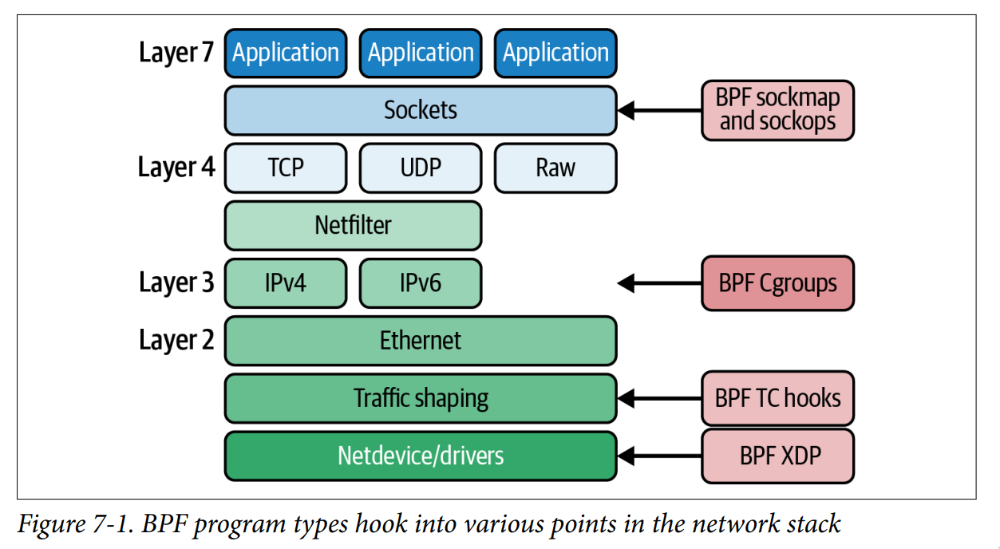

---
- [code examples github](https://github.com/lizrice/learning-ebpf)
- play dir: `mightyplay/ebpf/01_book-learning-ebpf`


---

# ch01: What Is eBPF, and Why Is It Important?

na


---


# ch02: eBPF's "Hello World"

- hello world example, the entrie python (bcc) program looks like
    ```python
    #!/usr/bin/python3
    from bcc import BPF

    program = r"""
    int hello(void *ctx) {
        bpf_trace_printk("Hello World!");
        return 0;
    }
    """

    b = BPF(text=program)
    syscall = b.get_syscall_fnname("execve")
    b.attach_kprobe(event=syscall, fn_name="hello")

    b.trace_print()
    ```

- to see all examples, goto: `mightyplay/ebpf/01_book-learning-ebpf/src/ch02`

- `/sys/kernel/debug/tracing/trace_pipe` - shared trace pipe for all bpf programs

---


# ch03: Anatomy of an eBPF Program

- BPF program goes through 3 stages:
    - first we do have a program written in `C` - the source code
    - then it is being compiled into "Bytecode", the result file of such compilation
      is often called an "Object File"
    - then once the object file is loaded into kernel it is being JITted into
      "Machine Code" (assembly)
    ```
    |-------------|   compilation   |---------------|  JIT   |--------------|
    | (limited) C | --------------> | eBPF bytecode | -----> | machine code |
    |-------------|                 |---------------|        |--------------|
    ```

- as a comparison to the previous python/bcc based program, here is the C hello world
  for a network interface, `hello.bpf.c`:
    ```c
    #include <linux/bpf.h>
    #include <bpf/bpf_helpers.h>

    int counter = 0;

    SEC("xdp")
    int hello(struct xdp_md *ctx) {
        bpf_printk("Hello World %d", counter);
        counter++;
        return XDP_PASS;
    }

    char LICENSE[] SEC("license") = "Dual BSD/GPL";
    ```

- `hello.bpf.c` -> once compiled (with `clang`), becomes `hello.bpf.o`, ELF (Executable and Linkable Format)
    ```sh
    % file hello.bpf.o
    hello.bpf.o: ELF 64-bit LSB relocatable, eBPF, version 1 (SYSV), with debug_info,
    not stripped
    ```

- which can be examine with `llvm-objdump`, this is basically the eBPF bytecode!
    ```
    % llvm-objdump -S hello.bpf.o

    hello.bpf.o: file format elf64-bpf

    Disassembly of section xdp:

    0000000000000000 <hello>:
    ; bpf_printk("Hello World %d", counter");
     0: 18 06 00 00 00 00 00 00 00 00 00 00 00 00 00 00 r6 = 0 ll
     2: 61 63 00 00 00 00 00 00 r3 = *(u32 *)(r6 + 0)
     3: 18 01 00 00 00 00 00 00 00 00 00 00 00 00 00 00 r1 = 0 ll
     5: b7 02 00 00 0f 00 00 00 r2 = 15
     6: 85 00 00 00 06 00 00 00 call 6
    ; counter++;
     7: 61 61 00 00 00 00 00 00 r1 = *(u32 *)(r6 + 0)
     8: 07 01 00 00 01 00 00 00 r1 += 1
     9: 63 16 00 00 00 00 00 00 *(u32 *)(r6 + 0) = r1
    ; return XDP_PASS;
     10: b7 00 00 00 02 00 00 00 r0 = 2
     11: 95 00 00 00 00 00 00 00 exit
    ```

- further, such object file can be loaded into kernel with `bpftool` (see [bpftool](./bpftool.md))
    ```sh
    % bpftool prog load hello.bpf.o /sys/fs/bpf/hello
    # ^^ the last argument above is to pin bpf program to userspace
    % ls /sys/fs/bpf
    hello
    ```

- once it is loaded we can do pretty cool stuff with it using `bpftool`
  (again, see [bpftool](./bpftool.md) for tool desc)
    ```sh
    % bpftool prog list                    # list all bpf programs loaded
    % bpftool prog show id 540 --pretty    # show/describe particular program

    % bpftool prog dump xlated name hello  # print “translated” bytecode
      # once it is loaded, passed verifier (and possibly modified)
      # this is equivalet of `llvm-objdump -S hello.bpf.o`

    % bpftool prog dump jited name hello   # aaaand finally this is the MACHINE CODE

    % bpftool net attach xdp id 540 dev eth0  # attach to the network interface
    % bpftool net list                        # list network bpf programs
    % bpftool net detach xdp dev eth0         # detach
    ```

---


# ch04: The bpf() System Call

- In general `bpf()` syscall has the following signature:
  ```
  int bpf(int cmd, union bpf_attr *attr, unsigned int size);
  ```
  three arguments are: the **command**, **attributes** (any attributes we wanna pass to the command), **size** (of the attributes).

  Examples:
    - `bpf(BPF_BTF_LOAD, {btf="\237\353\1\0...}, 128) = 3` - load BTF (BPF Type Format) data
    - `bpf(BPF_MAP_CREATE, {map_type=BPF_MAP_TYPE_HASH, key_size=4, value_size=12, max_entries=10240... map_name="config", ...btf_fd=3,...}, 128) = 5` - create BPF map of type HASH
    - `bpf(BPF_MAP_CREATE, {map_type=BPF_MAP_TYPE_RINGBUF, key_size=0, value_size=0, max_entries=4096, ... map_name="output", ...}, 128) = 4` - create bpf ring buffer
    - `bpf(BPF_PROG_LOAD, {prog_type=BPF_PROG_TYPE_KPROBE, insn_cnt=44, insns=0xffffa836abe8, license="GPL", ... prog_name="hello", ... expected_attach_type=BPF_CGROUP_INET_INGRESS, prog_btf_fd=3,...}, 128) = 6` - load BPF program into the kernel
    - `bpf(BPF_MAP_UPDATE_ELEM, {map_fd=5, key=0xffffa7842490, value=0xffffa7a2b410, flags=BPF_ANY}, 128) = 0` - update map element from the userspace

- BPF objects (programs, maps, debug info) are being created/loaded into kernel and stays
there, as long as the reference counter is > 0. Reference counter is increased whenever
a userspace program creates FD (file descriptor) etc.. Once the counter drops to 0, program (or actually
any BPF object) is deleted from kernel.

    See [blogpost](https://facebookmicrosites.github.io/bpf/blog/2018/08/31/object-lifetime.html) for detailed explanation.

---

# ch05: CO-RE, BTF, and Libbpf

- THE PROBLEM: the probelm is that, eBPF programs access kernel structures, that changes
  across differet versions

- `BCC` approach to compatibility - is to comiple the BPF program at runtime,
  that means on the destination machine. That causues a few issues, the main ones
  being:
    - compailer and kernel headers must be installed
    - you have to wait for the program to compile, before it actually starts

- `CO-RE` - compile once run everywhere - solves the problem of making eBPF
  programs portable across different kernel versions. It consists of a few elements:
    - [BTF (BPF Type Format)](https://docs.kernel.org/bpf/btf.html) - format of expressing the layout of data structures
      and function signatures
    - kernel headers
    - compiler support - clang and the `-g` option to include CO-RE relocations information
        (gcc since version 12 alos supports it)

- Andrii Nakryiko's posts on that topic:
    - [bpf-portability-and-co-re](https://nakryiko.com/posts/bpf-portability-and-co-re/)
    - [bpf-core-reference-guide](https://nakryiko.com/posts/bpf-core-reference-guide)
    - [libbpf-bootstrap](https://nakryiko.com/posts/libbpf-bootstrap/)
    - [bcc-to-libbpf-howto-guide](https://nakryiko.com/posts/bcc-to-libbpf-howto-guide)

- for all `bpftool` related command, eg: listing btf data in kernel, generating
  kernel headers file, etc...please refer to [btftool](../../COMMANDS/BPFTOOL/index.md)

- compiling CO-RE bpf programs
    ```
    hello-buffer-config.bpf.o: %.o: %.c
        clang \
            -target bpf \
            -D __TARGET_ARCH_$(ARCH) \
            -I/usr/include/$(shell uname -m)-linux-gnu \
            -Wall \
            -O2 -g \
            -c $< -o $@
        llvm-strip -g $@
    ```


---

# ch06: The eBPF Verifier

- [kernel bpf verifier docs](https://docs.kernel.org/bpf/verifier.html)

---

# ch07: eBPF Program and Attachment Types

- tere is currently around 30 program types and more than 40 attachment type ([bpf.h](https://elixir.bootlin.com/linux/v5.19.14/source/include/uapi/linux/bpf.h))
- the **TYPE** of BPF program defines what events can it be attached
- BPF program takes a **CONTEXT** argument (eg, a network packet, a infro about executed file etc..) - the context depends on the program type
  and it is a pointer to a structure (that depends on an event that triggered it)
- **TRACING** types. Sometimes reffered as "perf-related" programs.
    - `bpftool perf show` - prints all programs attached to tracing/perf related events
    Sometimes
    - `k(ret)probes` - allow to attach to an entry and return of a:
        - syscall
        - kernel function
    - `fentry/fexist` - new and recommended way of attaching to a kernel function
    - `tracepoints` - "static"/"predefined"/"marked" places in the kernel where you can attach a bpf program, you can list all of them by `cat /sys/kernel/tracing/available_events`,
       a tracepoint has a format of `tracing_subsystem:tracepoint_name` for instance `syscalls:sys_enter_execve`
        - it is possible to print more info about a tracepoint by `cat /sys/kernel/tracing/events/syscalls/sys_enter_execve/format`
        - there are also BTF-Enabled tracepoints
    - `u(ret)probes)` - **USER SPACE** equivalet of kprobes, probes allowing to attach to a **USER SPACE** functions
    - `USDT (user statically defined tracepoints)` - **USER SPACE** equivalet of tracepoints
        - There are a few gotchas to be aware of when instrumenting user space code:
            - the path to shared libraries may be architecture specific,
              so you may need corresponding architecture-specific definitions.
            - unless you control the machine you’re running the code on, you can’t know what
              user space libraries and applications will be installed.
            - an application might be built as a standalone binary, so it won’t hit any probes
              you might attach within shared libraries.
            - containers typically run with their own copy of a filesystem, with their own set
              of dependencies installed in it. The path to a shared library used by a container
              won’t be the same as the path to a shared library on the host machine.
            - Your eBPF program might need to be aware of the language in which an application was written.
- **LSM** (linux security module)
    - BPF_PROG_TYPE_LSM programs are attached to the Linux Security Module (LSM) API,
    - interesting characteristic is that the return value of the BPF programm affects the way the kernel
      behaves - A nonzero return code indicates that the security check wasn’t passed, so the
      kernel won’t proceed
    - [kernel LSM BPF programs documentation](https://www.kernel.org/doc/html/latest/bpf/prog_lsm.html)

- **NETWORKING**
    - networking BPF programs can be attached in different places, starting from `Layer 2`, up to `Layer 7 sockets`
    
    - networking BPF programs have two main characteristics:
        - return code from the eBPF program tells the kernel what to do with a
          network packet - which could involve processing it as usual, dropping it, or
          redirecting it to a different destination
        - eBPF program can modify network packets, socket configuration parameters, and so on
    - networking program types (first three are the most popular):
        - `Sockets` - relates to sockets and socket operations
        - `Traffic Control` - for network traffic control and shaping
        - `XDP (eXpress Data Path)` -
        - `Flow Dissector` - to extract details froma packet's headers.
        - `Lightweight Tunnels` - can be used to implement network encapsulation in eBPF programs
          In practice, these are used infrequently.
        - `Cgroups` - Attaching eBPF programs to a cgroup allows for custom behavior that only applies to that cgroup’s processes
        - `Infrared Controllers` - provide decoding for infrared protocols

---

# ch08: eBPF for Networking

This chapter is all about eBPF for Networking. Differet types, and their use cases.
Mostly on `XDP` and `TC`, and the differces between them.

My uderstanding:
- XDP
    - is done much earlier, before hitting the kernel networking stack
    - support only ingress
    - it's possible to attach only SINGLE program to XDP
- TC
    - done once the kernel creates [sk_buff](https://wiki.linuxfoundation.org/networking/sk_buff) struct
    - support both ingress and egress
    - it's possible to attach MULTIPLE programs


Some links:
- [xdp vs tc - cilium docs](https://docs.cilium.io/en/latest/bpf/progtypes/)
- [life of a packet in cilium](https://arthurchiao.art/blog/cilium-life-of-a-packet-pod-to-service/)
- [xdp tutorial](https://github.com/xdp-project/xdp-tutorial)
- [tc direct action](https://qmonnet.github.io/whirl-offload/2020/04/11/tc-bpf-direct-action/)
- [youtube: liz rice - load balancer from scratch](https://github.com/xdp-project/xdp-tutorial)

---

# ch09: eBPF for Security

- seccomp
    - [inspektor-gadget](https://www.inspektor-gadget.io/) and its `seccomp-profile` can be used to
      record syscalls that are issued in a specified k8s pod and then use this information to generate
      the corresponding seccomp profile
    - [default docker seccomp profile](https://github.com/moby/moby/blob/master/profiles/seccomp/default.json)
    - [cool list of syscalls](https://filippo.io/linux-syscall-table/)
- syscall-tracking security tools
    - [https://falco.org/](https://falco.org/) - both kernel module and eBPF based
    - [sysmon for linux](https://github.com/Sysinternals/SysmonForLinux)
- BPF LSM
    - [youtube: LSM BPF Change Everything](https://www.youtube.com/watch?v=l8jZ-8uLdVU)
- [cilium tetragon](https://github.com/cilium/tetragon)

---


# ch10: eBPF Programming

- TLDR;
    - `C` + `libbpf`
    - `GO` + `ebpf`
    - `Rust` + `aya`
    - list of most up to date libraries, runtimes, etc... -> [https://ebpf.io/infrastructure/](https://ebpf.io/infrastructure/)

- [bpftrace](../../PROGRAMMING/BPFTRACE/index.md)

- eBPF programming can be split into:
    - `in kenrel` - so that's the actual code that is being transleted into bytecode
        and here we do have only two options:
        - `C`
        - `Rust`
    - `in userspace` - this is the userspace program that actually loads the
        the ebpf program into kernel, reads the maps, etc..., and here we do
        have quite a few options

- `in userspace` programming:
    - `python` and `BCC` library
        - [tutorial](https://github.com/iovisor/bcc/blob/master/docs/tutorial_bcc_python_developer.md)
        - unfortunatelly this is not CO-RE approach, see ch05 for more details
    - `C` and `libbpf` (+ `libxdp` that is buiild on `libbpf`)
        - CO-RE approach
        - [libbpf-bootstrap github](https://github.com/libbpf/libbpf-bootstrap)
        - [libbpf-bootstrap blogpost](https://nakryiko.com/posts/libbpf-bootstrap)
        - [libcdp tutorial](https://github.com/xdp-project/xdp-tutorial)
    - `GO`
        - [ebpf](https://github.com/cilium/ebpf) - pure go, co-re support - from cilium
        - [Getting Started with eBPF and Go](https://networkop.co.uk/post/2021-03-ebpf-intro/) blogpost
        - [libbpfgo](https://github.com/aquasecurity/libbpfgo) - wrapper around libbpf's C code - from aqua security
    - `Rust`
        - [aya](https://aya-rs.dev/book/) - co-re, no libbpf dependency


---


# ch11: The Future Evolution of eBPF

na
