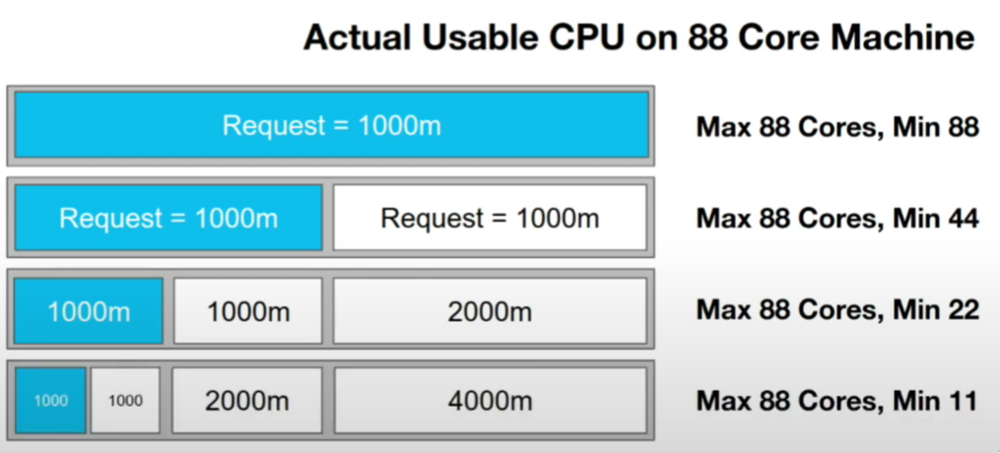
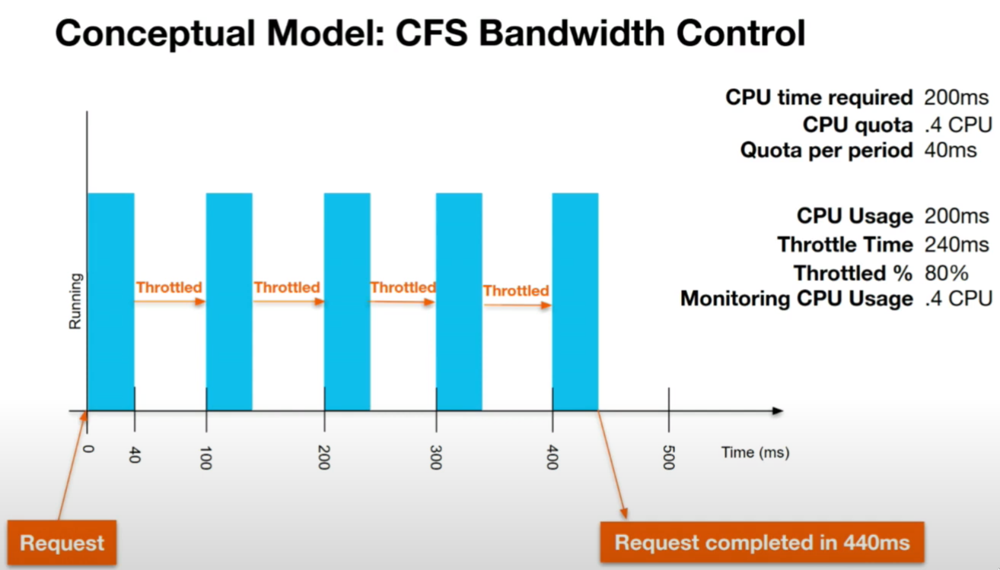

# 

# basics
We do have two kinds of CPU limits in linux:
- `soft` limit - `resources.requests.cpu` in k8s - Cgroup `cpu.shares`
- `hard` limit - `resources.limits.cpu` in k8s) - Cgroup CFS Bandwidth Control

## soft limits
- `soft limits` = `.requests` = Cgroup `cpu.shares`
- under the cover soft limit is using Cgroup `cpu.shares`
    - /sys/fs/cgroup/cpu,cpuacct/.../cpu.shares
    - the value of that file is usually what we have set in k8s `resources.requests.cpu`
- it basically means how all available cpus are shared across processes
- if we have two processes both are trying to use cpu all the time, the first one has `100m` soft limit,
  second one has `200m`, the second one will get 2x more cpu time than the first one, but still both will use ALL
  the CPUs



## hard limits
- `hard limits` = `.limtis` = Cgroup CFS Bandwidth Control
- under the cover it uses Cgroup CFS Bandwidth Control: `cpu.cfs_period_us` and `cpu.cfs_quota_us`
    - /sys/fs/cgroup/cpu,cpuacct/.../cpu.cfs_period_us
    - /sys/fs/cgroup/cpu,cpuacct/.../cpu.cfs_quota_us
- by default `cfs_period_us` = `100000` = `100ms`
- `cfs_quota_us` = what we have set for `resources.limits.cpu` divided by 10, why? examples:
    - k8s limit: 500m (0.5core), cfs_period: 100ms, cfs_quota: 50ms 
    - k8s limit: 2000m (2core), cfs_period: 100ms, cfs_quota: 200ms 
- after the process used all the quota in a period, it gets THROTTLED

# throttling explained
## tldr
metric we should monitor, percentage of periods when the application was throttled "CPU throttled percentage"
```
throttled% = (nr_throttled / nr_periods)
```
```
throttled% = container_cpu_cfs_throttled_periods_total / container_cpu_cfs_periods_total
```

## details

- cgroup file `cpu.stat`
    - `nr_periods` - number of periods process was running
    - `nr_throttled` - number of periods process was throttled, aka, process was runnable, and it used entire quota
    - `throttled_time` - sum of time, threads in a cgroup was throttled
- note on `throttled_time`: this is useless metric, for instance if in our cgroup (pod), we do have 2 threads, and two of them want to use cpu, but the pod already used its quota, the `throttled_time` will be increased by 2 * xxxms, if we would have 100 threads, it would increase 100 * xxxms - blaaah




# links
- Dave Chiluk, Indeed ~> [https://www.youtube.com/watch?v=UE7QX98-kO0](https://www.youtube.com/watch?v=UE7QX98-kO0)
- to limit or not to limit ~> [https://www.youtube.com/watch?v=KCFFZ_qfKXk](https://www.youtube.com/watch?v=KCFFZ_qfKXk)
- disable limit -> [https://youtu.be/eBChCFD9hfs?t=1437](https://youtu.be/eBChCFD9hfs?t=1437)

# kinda my recommendation

Based on all my knowledge, documentation, youtube videos etc...

My suggestion is:
- memory
    - same value request as limits
- cpu
    - requests yes
    - do not use limits
