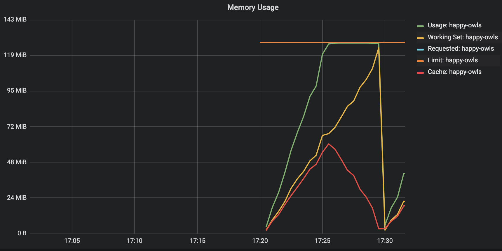

# memory usage
## tldr

- use `container_memory_usage_bytes` as a main memory metric
- oomkiller kills process based on this metric

## details

- `container_memory_usage_bytes`
    - usually the biggest value
    - it is indeed current memory usage, but the value includes filesystem cache,
      so for programs that use files (read or write), the difference (between other memory metrics) can be pretty big (eg: prometheus),
      but, also the cache can be "dropped" if needed, for instance if the process is hitting its memory limit 
    - the value is fetched from `memory.usage_in_bytes` cgroup file
    - `container_memory_usage_bytes` = `container_memory_rss` + `container_memory_cache` + `container_memory_swap` + kernel memory not exposed by cadvisor
    - example value for prometheus process: `5545Mb`
- `container_memory_working_set_bytes`
    - "in the middle" in terms of the value
    - "recently accessed" memory, it is an estimation of how much mermory cannot be evicted
    - the value is calculated from cgroup files: `memory.usage_in_bytes` - `memory.status:total_inactive_file`
    - `container_memory_working_set_bytes` = `container_memory_usage_bytes` - "<inactive_memory>"
    - example value for prometheus process: `2549Mb`
    - [link to cadvisor code](https://github.com/google/cadvisor/blob/ce07bb28eadc18183df15ca5346293af6b020b33/container/libcontainer/handler.go#L831-L844)
- `container_memory_rss` (this is NOT! the same as RSS from `ps` command)
    - usually the lowest value from these three metrics
    - includes all the anonymous pages (all stack and heap memory)
    - the value is fetched from `memory.status:total_rss` (file `memory.status`, field `total_rss`)
    - example value for prometheus process: `2201Mb`

## corelation

## links:
- [https://faun.pub/how-much-is-too-much-the-linux-oomkiller-and-used-memory-d32186f29c9d](https://faun.pub/how-much-is-too-much-the-linux-oomkiller-and-used-memory-d32186f29c9d)
- [https://lwn.net/Articles/432224/](https://lwn.net/Articles/432224/)
- inactive_memory kernel concept: [https://www.kernel.org/doc/gorman/html/understand/understand013.html](https://www.kernel.org/doc/gorman/html/understand/understand013.html)

# memory failures
- `container_memory_failures_total{failure_type="pgfault"}`
    - minor page fault
    - this is basically OK, does not require disk IO
    - it occurs when a process does not have a logical mapping to a page, from its memory map to phisiacl map,
      but the data is actually in the phisical memory
- `container_memory_failures_total{failure_type="pgmajfault"}`
    - major page fault
    - this is basically BAD, does require disk IO
    - it occurs when a process requests some data that is not in phisical memory, and must be read from disk
      to be placed there
