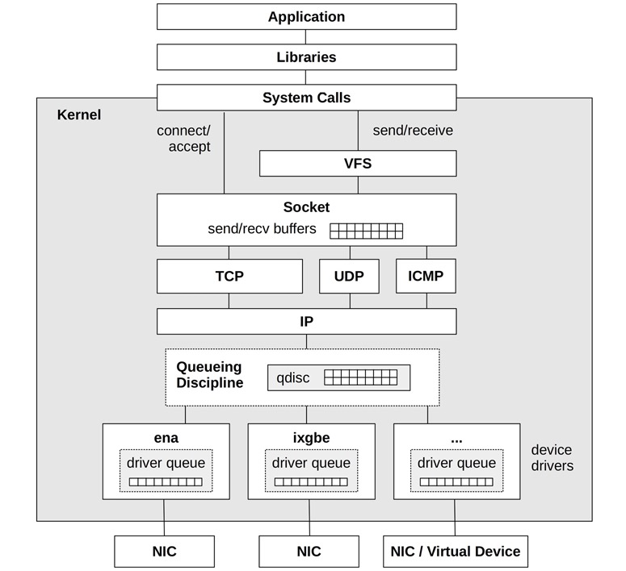
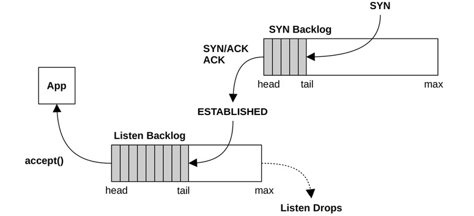

# How packet flows via network stack (with tuning/debuging in mind)

### Disclaimer
this is my understanding, and I made a bunch of shortcuts in this notes
in purpouse. See some links for more detailed explanation:
- please start with **NETWORKING** chapters of Brendan Gregg books
- [https://tungdam.medium.com/linux-network-ring-buffers-cea7ead0b8e8](https://tungdam.medium.com/linux-network-ring-buffers-cea7ead0b8e8)
- [https://optiver.com/working-at-optiver/career-hub/searching-for-the-cause-of-dropped-packets-on-linux/](https://optiver.com/working-at-optiver/career-hub/searching-for-the-cause-of-dropped-packets-on-linux/)
- [https://blog.tsunanet.net/2011/03/out-of-socket-memory.html](https://blog.tsunanet.net/2011/03/out-of-socket-memory.html)
- [https://www.coverfire.com/articles/queueing-in-the-linux-network-stack/](https://www.coverfire.com/articles/queueing-in-the-linux-network-stack/)
- [https://blog.packagecloud.io/monitoring-tuning-linux-networking-stack-sending-data/](https://blog.packagecloud.io/monitoring-tuning-linux-networking-stack-sending-data/)
- [https://blog.packagecloud.io/monitoring-tuning-linux-networking-stack-receiving-data/](https://blog.packagecloud.io/monitoring-tuning-linux-networking-stack-receiving-data/)
- [https://blog.packagecloud.io/illustrated-guide-monitoring-tuning-linux-networking-stack-receiving-data/](https://blog.packagecloud.io/illustrated-guide-monitoring-tuning-linux-networking-stack-receiving-data/)

- new! [https://www.kungfudev.com/blog/2024/06/14/network-sockets-syn-and-accept-queue](https://www.kungfudev.com/blog/2024/06/14/network-sockets-syn-and-accept-queue)

### ok, lesssgo

- First of: **SEND** and **RECEIVE** paths are different.
- Second of: I'm going to just write some text, to see some nice pictures
  please open links above

#### SEND path
**TODO**

#### RECEIVE path
- nic receives a packet
- it is being put in a "ring buffer", aka "driver queue"
- ring buffer does not contain actual data, but POINTERS to memory area where
  packet are being copied by nic via DMA (direct memory access)
- when data is saved in memory, nic sends **hardware interrupt** (HARD IRQ)
  which in turn triggers **softwarde interrupt** (SOFT IRQ), `NET_RX_SOFTIRQ` signal
  sent to kernel thread `ksoftirqd` (one per CPU thread)
- main function that pulls data from ring buffer is called `net_rx_action`,
  it allocates SKB data structures (SKB == socket kernel buffer, `struct sk_buff`)
  via `alloc_skb()`, it copies the data from DMA sections to the new structs,
  and copute and populate all the fields of sk_buff struct,
  once this is done, packet is ready to be passed to the network stack
- hence, if traffic is busy, you can see `ksoftirq` thread consuming a lot of
  CPU by `net_rx_action`, but of course it has a limited budget to run.
  There are 3 cases, when that fuction stops:
    - there is no more data to read from
    - it exceeded `budget` defined by `net.core.netdev_budget` – amount of packets
      that can be handled at most in a single run
    - it took too long to finish (`net.core.netdev_budget_usecs`)
    - (you can find the details on the above here `/proc/net/softnet_stat`)
- network data frames are handed to the protocol layers via `netif_receive_skb()`
- protocol layers process data
- data is added to receive buffers attached to sockets by protocol layers
- data is read fron a socket by an application
- quick note on: iptables vs tcpdump - what's first:
    - iptables are first - to be more specific - netfilter processing - which
      kicks in just after packet is passed to protocol layers
    - tcpdump - aka berkeley packet filters - kicks in just before sending
      data to a socket - so almost at the very end, just before it is read
      by an application

#### linux network stack

#### linux tcp backlogs
- `SYN backlog`/`SYN queue` - a queue for TCP connections
  that received only SYN, and are waiting to be fully ESTABLISHED, once that
  happen, TCP session is moved to LISTEN backlog
- `LISTEN backlog` - queue of ESTABLISHED sessions waiting to be
  accepted by the application

IMPORTANT: both of the above are PER socket in LISTEN state!
(99% sure about that, I previously thought that the first one is global)

#### Quick Short Notes
- **NOTE:** there is a lot of "advanced"
  algorithms and magic that work to imporve permormance of receiving or sending packets,
  especially for TCP. Eg: GSO/GRO/TSO, congestion controls, queueuing siciplines,
  TSQ (TCP small queues), BQL (byte queue limits), etc...

  all of that can affect how the packets are going through and being processed,
  it's not that easy and simple
- **CPU Scaling** - by default NIC may interrupt
  only one CPU, which can reach 100% utilization and become a bottleneck.
  To avoid this linux supports multi-CPU packet processing, but it must be
  configured! see official linux
  [documentation](https://docs.kernel.org/networking/scaling.html)
- **segmentation offloading** - GSO (generic
  segmentation offload), GRO (generic receive offload) - implemented in kernel,
  TSO (TCP segmentation offload) - implemented by NIC - tldr; allowes to create
  big packets by network stack, that are split into small as 1500bytes just before
  they are sent by NIC
- **BQL Byte Queue Limits** - limits how many
  bytes can be put into driver queues
